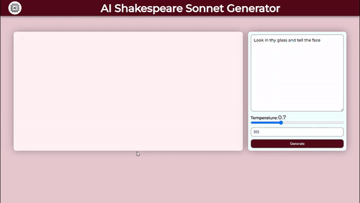

# AI Sonnet

The AI Shakespeare Sonnet Generator is a web application that utilizes a deep learning model running on the server to generate Shakespearean-style sonnets. Users can input an initial prompt, specify the temperature for generating text, and set the desired length of the sequence to be generated.

## Features 

- Deep Learning Model: The application leverages a deep learning model trained on Shakespearean texts to generate sonnets.
- Express and Node.js: Built with Express.js and Node.js for the server-side functionality.
- User Input: Users can provide an initial prompt to guide the generation process.
- Temperature Control: The temperature parameter adjusts the creativity and randomness of the generated text.
- Sequence Length: Users can specify the length of the sequence to be generated.

## Dataset

This Model is based on all of Shakespeares Sonnets as its dataset. The book can be found under Project Gutenberg: [Sonnet Collection](https://www.gutenberg.org/ebooks/1041)

## Metrics

## Usage

- Input Prompt: Enter an initial prompt to guide the generation process.
- Set Temperature: Adjust the temperature parameter to control the creativity and randomness of the generated text.
- Specify Sequence Length: Set the desired length of the sequence to be generated.
- Generate Sonnet: Click on the "Generate" button to generate a Shakespearean-style sonnet.

## Getting Started

### Prerequisites

- Python 3.x
- Node.js

If you want to run the application locally use following steps -

- git clone `https://github.com/darthdaenerys/Ai-Sonnet.git`
- Navigate to the project directory: `cd Ai-Sonnet`
- Install Python dependencies: `pip install -r requirements.txt`
- Install Node.js dependencies: `npm install`
- Start the server: `node index.js`
- Open [http://localhost:3000](http://localhost:3000) to view it in your browser.

## Contributing

If you would like to contribute to this project, you can fork the repository and submit a pull request with your changes. Please make sure to test your changes thoroughly before submitting the pull request.

## Acknowledgments

The AI Sonnet Generator was inspired by the timeless works of William Shakespeare and the advancements in natural language processing and deep learning.

Feel free to explore, experiment, and immerse yourself in the beauty of AI-generated poetry.

*Thanks for visiting!*
